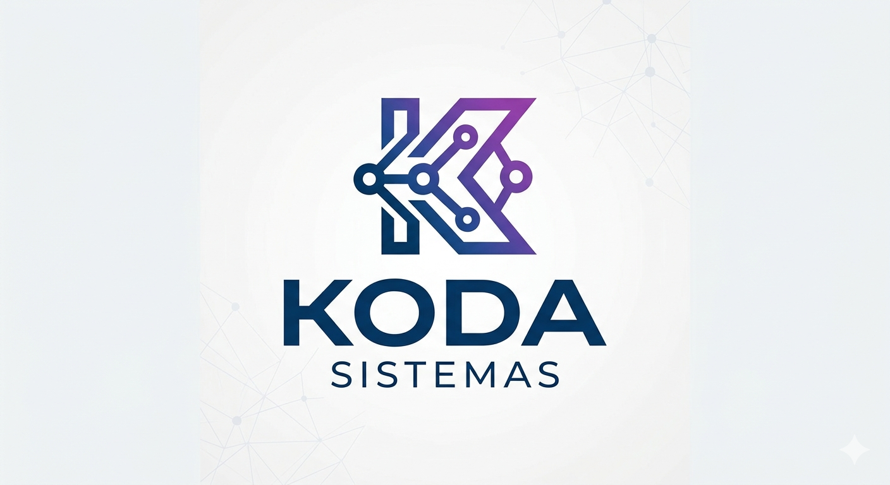

# 🛒 Controle de Validade Profissional | Koda Sistemas 🛡️

**Sistema inteligente para monitoramento de estoque e prevenção de perdas de produtos perecíveis.**

🌐 **Acesso ao Sistema:** [Clique aqui para abrir](https://lucas-silva28.github.io/Controle_de_Validade/)

  <!-- Espaço para sua futura logo -->
  

---

## 📝 1. Visão Geral
Esta solução foi desenvolvida pela **Koda Sistemas** para automatizar o controle de validade em comércios e depósitos[span_0](start_span)[span_0](end_span). O foco principal é a praticidade no lançamento de dados e a precisão no monitoramento de itens como bebidas e alimentos, garantindo que nenhum produto vença na prateleira.

---

## 📸 2. Demonstração Visual

Abaixo, você confere a interface e as ferramentas disponíveis no sistema:

### 🖥️ Painel de Controle e Status
O sistema classifica automaticamente a urgência de cada item através de alertas visuais.

| Dashboard Principal | Monitoramento de Vencidos |
| :---: | :---: |
|  |  |
| *Visualização clara de todo o estoque.* | *Alertas coloridos por nível de criticidade.* |

---

### 🎨 Personalização e Modo Escuro
Interface moderna adaptada para qualquer ambiente de trabalho.

| Modo Escuro | Gestão de Perfil |
| :---: | :---: |
|  |  |
| *Conforto visual para conferências rápidas.* | *Personalização da unidade de atendimento.* |

---

### 🚀 Operação e Relatórios
Ferramentas de busca avançada e exportação de documentos oficiais.

| Busca e Filtros | Exportação de Relatórios |
| :---: | :---: |
|  |  |
| *Localize qualquer produto em segundos.* | *Geração de PDF para auditoria e controle.* |

---

## ⚙️ 3. Funcionalidades de Destaque
* **Gestão Mobile:** Otimizado para uso em dispositivos móveis, facilitando a conferência direta no estoque[span_1](start_span)[span_1](end_span).
* **Backup de Segurança:** Sistema de importação e exportação de dados para garantir que suas informações estejam sempre salvas.
* **Cálculo em Tempo Real:** O sistema indica exatamente quantos dias restam para o vencimento sem necessidade de cálculos manuais.
* **Compartilhamento:** Envio rápido de listas de produtos críticos via redes sociais.

---

## 🛠️ 4. Tecnologias Utilizadas
* **Desenvolvimento Web:** HTML5, CSS3 e JavaScript ES6+[span_2](start_span)[span_2](end_span).
* **Automação:** Lógica em Python para processamento de dados[span_3](start_span)[span_3](end_span).
* **Persistência:** Armazenamento local seguro para funcionamento offline.

---

**Koda Sistemas** 📍 Araguaína - Tocantins[span_4](start_span)[span_4](end_span)  
*Tecnologia que impulsiona a organização do seu negócio.*
