# 🛡️ Controle de Validade Profissional
**Gestão inteligente de estoque e monitoramento de vencimentos em tempo real.**

## 📝 1. Visão Geral do Sistema
O **Controle de Validade Profissional** é uma solução robusta e intuitiva projetada para otimizar a gestão de estoque. Focado em usabilidade e eficiência, o sistema permite que colaboradores e gestores monitorem prazos de validade com precisão cirúrgica, reduzindo perdas financeiras e garantindo a conformidade sanitária.

### Diferenciais Técnicos:
* **HTML5 Semântico:** Estrutura limpa e acessível.
* **CSS3 Dinâmico:** Interface responsiva com suporte nativo a temas (Light/Dark).
* **JavaScript ES6+:** Processamento de dados em tempo real sem recarregamento de página.
* **jsPDF Profissional:** Geração de relatórios técnicos formatados.
* **LocalStorage API:** Persistência de dados local segura.

---

## 🏗️ 2. Arquitetura Funcional
O sistema é dividido em quatro pilares principais para garantir um fluxo de trabalho fluido:

* **Identidade e Perfil:** Customização total da interface e relatórios com os dados do responsável.
* **Banco de Inteligência:** Armazenamento local de produtos para preenchimento automático ultra-rápido.
* **Gestão de Inventário:** Lançamento simplificado com cálculo automático de dias restantes e status de risco.
* **Exportação e Segurança:** Geração de documentos PDF oficiais, integração com redes sociais e sistemas de backup.

---

## 📸 3. Demonstração Visual (Manual de Screenshots)

Abaixo estão as 15 capturas de tela que exemplificam a profundidade e a facilidade de uso do sistema:

### 🖼️ Interface e Personalização

**IMAGEM 01: DASHBOARD INICIAL**
> *Onde capturar: Logo ao abrir o sistema.*
> Exibe a saudação personalizada e o menu de navegação superior com ícones intuitivos.
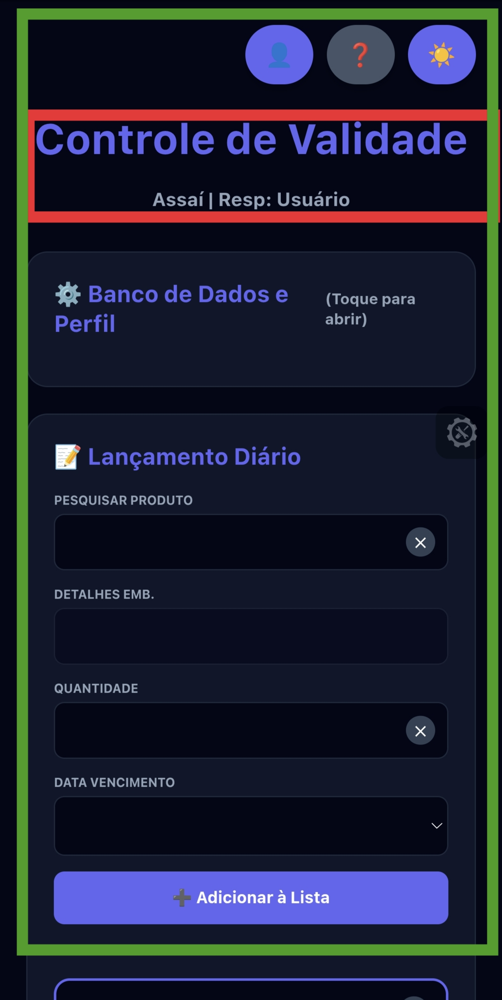

**IMAGEM 02: TELA DE PERFIL (FOCO VISUAL)**
> *Onde capturar: Menu de perfil.*
> Demonstra a estética moderna com foto de capa e avatar circular personalizado.
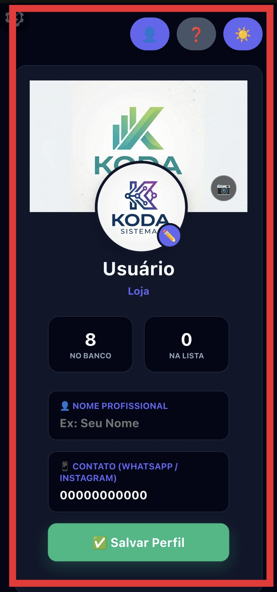

**IMAGEM 03: EDIÇÃO DE DADOS PROFISSIONAIS**
> *Onde capturar: Rodapé da tela de perfil.*
> Mostra os campos onde o usuário define seu nome para assinatura automática nos relatórios.
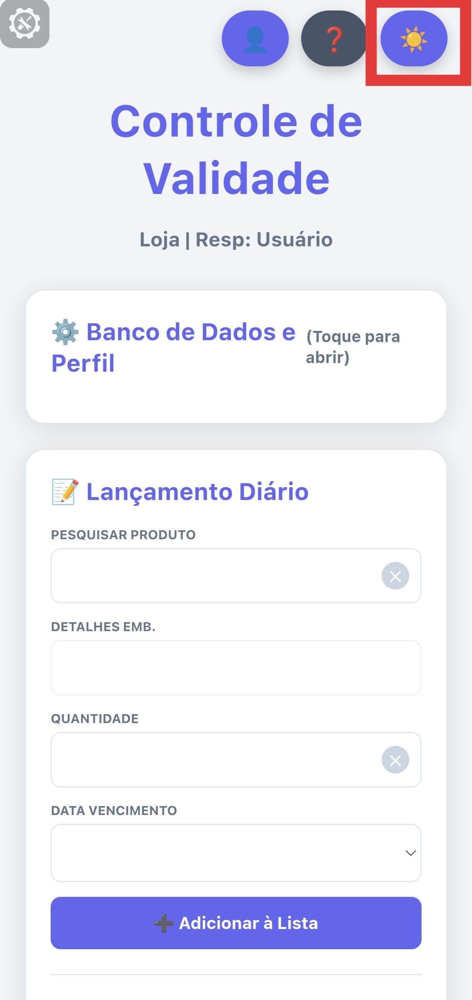

**IMAGEM 04: MODO ESCURO (DARK MODE)**
> *Onde capturar: Botão de alternância de tema.*
> Exibe a interface adaptada para ambientes de baixa luminosidade, reduzindo a fadiga visual.
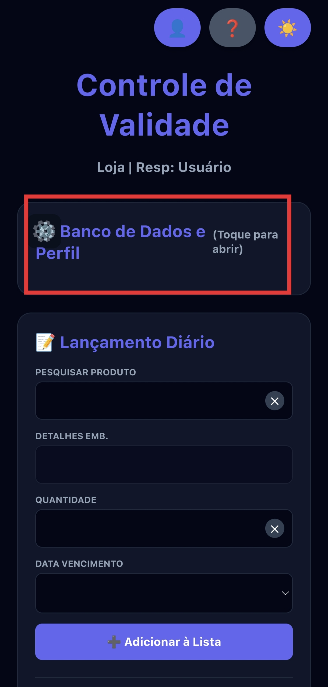

---

### 🗄️ Inteligência e Banco de Dados

**IMAGEM 05: GESTÃO DE GRAMATURAS (TAGS)**
> *Onde capturar: Configurações de Banco de Dados.*
> Sistema de tags para padronização de pesos e medidas (ex: 1kg, 2L).
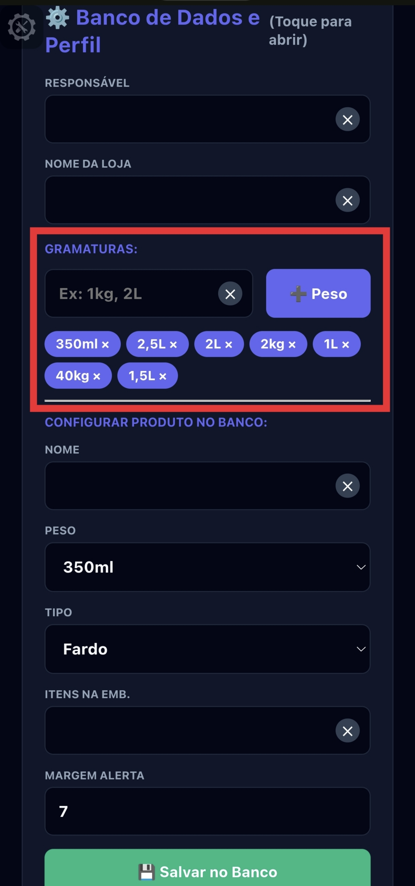

**IMAGEM 06: FORMULÁRIO DE CADASTRO NO BANCO**
> *Onde capturar: Seção de configuração de novos produtos.*
> Mostra como o sistema aprende os detalhes técnicos de cada item do estoque.
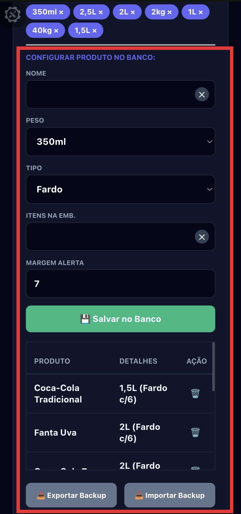

**IMAGEM 07: LISTAGEM DO BANCO DE DADOS**
> *Onde capturar: Tabela de produtos salvos.*
> Visualização clara de todos os itens prontos para lançamento rápido.
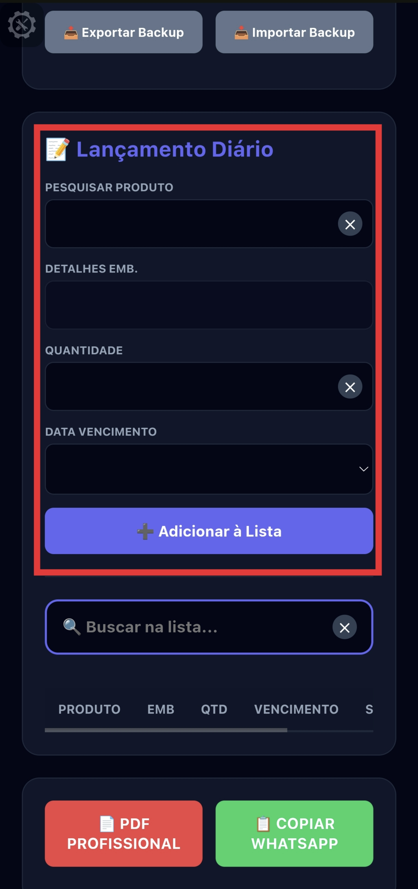

---

### 🚀 Operação e Monitoramento

**IMAGEM 08: LANÇAMENTO COM AUTO-FILL**
> *Onde capturar: Campo de nome no lançamento diário.*
> Demonstra a busca inteligente que preenche os dados da embalagem automaticamente.
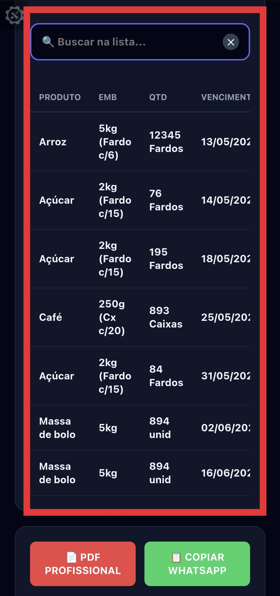

**IMAGEM 09: SELETOR DE DATA E CALENDÁRIO**
> *Onde capturar: Seleção de vencimento.*
> Interface otimizada para evitar erros humanos na inserção de datas críticas.
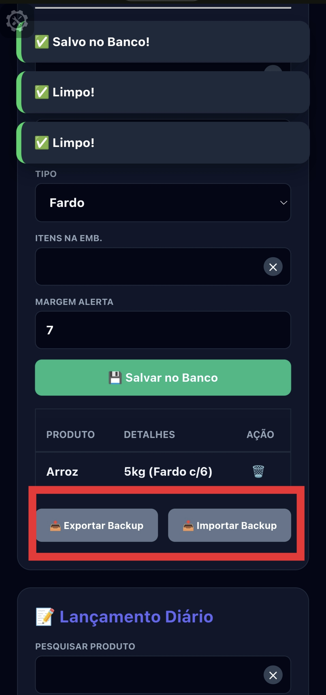

**IMAGEM 10: TABELA DE MONITORAMENTO ATIVA**
> *Onde capturar: Painel principal de listagem.*
> Exibe os produtos lançados com quantidades e datas formatadas (PT-BR).
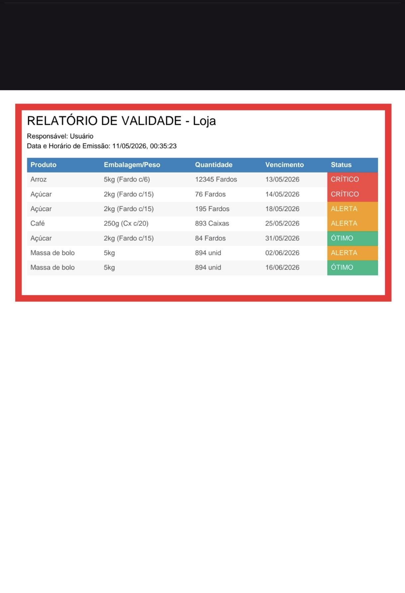

**IMAGEM 11: BADGES DE STATUS (ESTRATÉGIA VISUAL)**
> *Onde capturar: Coluna de status da tabela.*
> Cores intuitivas: Verde (Ótimo), Amarelo (Alerta) e Vermelho (Crítico).
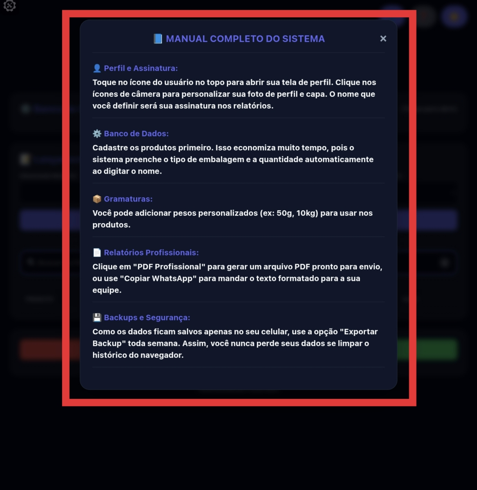

**IMAGEM 12: BUSCA E FILTRAGEM NA LISTA**
> *Onde capturar: Barra de pesquisa superior.*
> Filtragem instantânea que facilita a localização de itens em listas extensas.

---

### 📄 Relatórios e Segurança

**IMAGEM 13: RELATÓRIO PDF GERADO**
> *Onde capturar: Visualização do PDF gerado.*
> Exibe o documento oficial com data, hora e assinatura do desenvolvedor.

**IMAGEM 14: INTEGRAÇÃO WHATSAPP (TOAST)**
> *Onde capturar: Ao clicar em "Copiar WhatsApp".*
> Mostra a notificação de sucesso e a formatação do texto para envio imediato.

**IMAGEM 15: SISTEMA DE BACKUP E SEGURANÇA**
> *Onde capturar: Rodapé das configurações.*
> Botões de Exportar/Importar que garantem a portabilidade total dos seus dados.

---

## 🏆 4. Conclusão e Autoria
Este sistema representa uma solução completa de ponta a ponta. Desde a entrada de dados inteligente até a exportação de documentos oficiais, cada linha de código foi pensada para oferecer a melhor experiência ao usuário final. A documentação visual garante que o valor prático e técnico deste projeto seja compreendido instantaneamente.

**Desenvolvido por Lucas Silva** 📍 Araguaína, Tocantins - 2026  
*© Todos os direitos reservados.*
